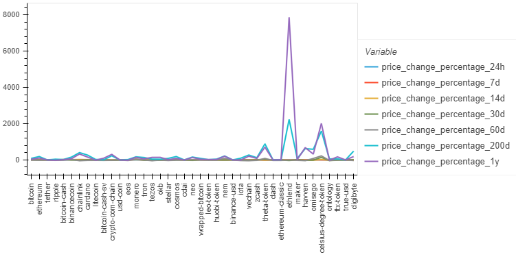
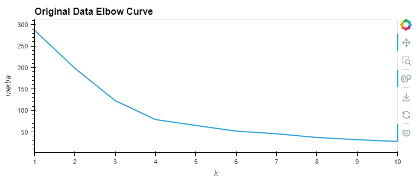
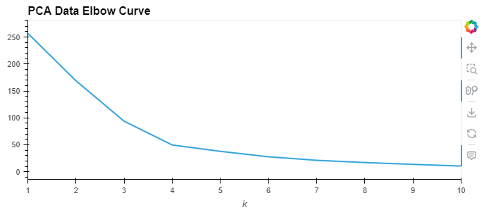
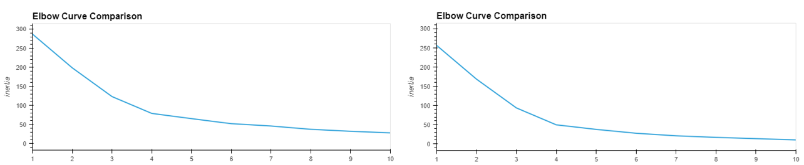
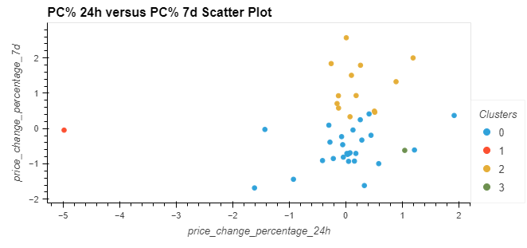
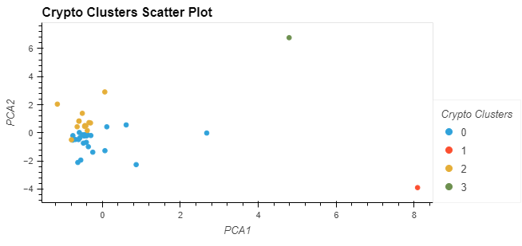
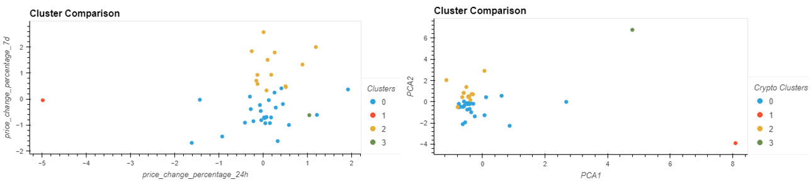

**Cryptocurrency Clustering Challenge**

**(1) Project Overview and Purpose: **

The purpose of this exercise is to use Python and unsupervised learning to predict if cryptocurrencies are affected by 24-hour or 7-day price changes. First, original data from a .csv file was used for ascertaining the best k value (visualized on an Elbow Curve) and plotting clusters on Scatter Plots via K-Means. Secondly, Principal Component Analysis (PCA) was used to optimize the clusters, then finding the best k value (visualized on an Elbow Curve) and plotting clusters on Scatter Plots via K-Means for transformed data. Lastly, the first and second parts were visualized in tandem and compared.

**(2) Dataset Description:** 

The dataset includes various crytocurrencies and multiple values for price change percentage at 24 hours, 7 days, 14 days, 30 days, 60 days, 200 days, 1 year, respectively. Data is stored in a .csv file, stored in the Resources folder.

**(3) Data Cleaning and Preprocessing:**

The data in this dataset did not required dropping any rows for missing or incomplete data. Data was normalized with the StandardScalar module to make the modified DataFrame (named "market_data_scaled"). A Principal Component Analysis [PCA] model was used later in the exercise.

**(4) Data Visualization Techniques:**

Two types of visualizations were generated for this exericse. 

Line graphs were used to show:

(a) all cryptocurrencies and their percent change values; 

(b) an Elbow Curve [EC] for the scaled data;

(c) EC of data after PCA

(d) a composite EC showing EC for (b) and (c) above.

Scatter plots were used to:

(e) Clusters for Price Change Percentage at 24 hours versus 7 days

(f) Optimized Clusters after PCA completed

(g) a composite of (e) and (f) above

**(5) Results and Analysis:**

(Present the insights gained from the data visualization. Describe any patterns, trends, or relationships discovered in the data.)

**(6) Ethical Considerations:**

(Discuss any ethical considerations taken into account during the project, such as data privacy, bias, or fairness.)

**(7) Instructions for Interacting with the Project:**

(Provide clear instructions on how to interact with the visualizations, such as how to run the code or access the visualizations.)

**(8) Citations:**

(Include references to the data sources used, any external libraries or tools utilized, and any other resources that contributed to the project.)

**(9) Future Work:**

(Suggest potential future work or improvements that could be made to the project, such as additional analyses or visualizations.)

